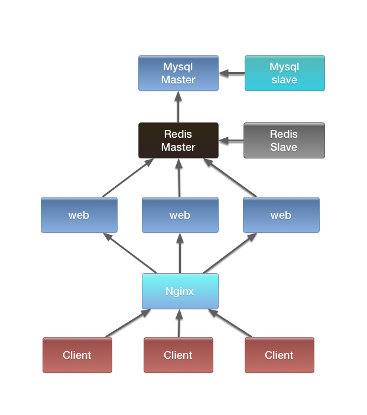
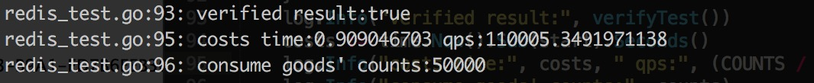
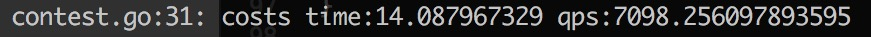

# highlycon

## Architecture

## redis qps test
1. 开启一个redis节点 port 6001
2. cd helper && go test

## mysql transaction qps test

1. cd mysql
2. create table
3. go test

## web qps test(use redis as cache)

1. go run web
2. cd test
3. go run contest.go

